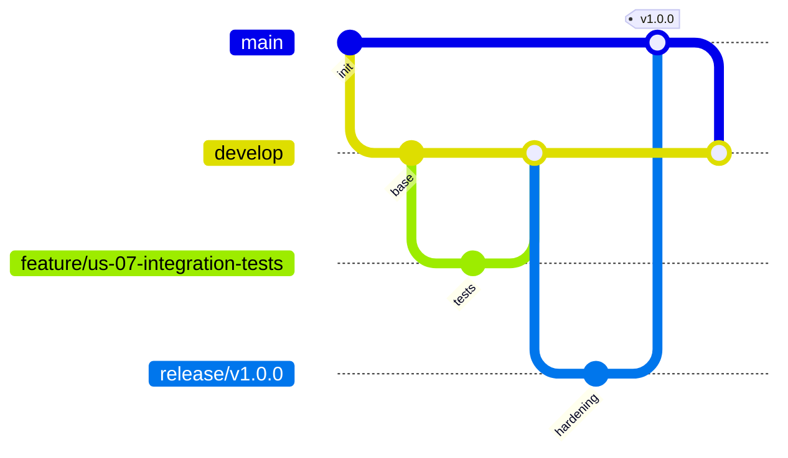

# Metodología Ágil y Estrategia de Branching — CircleGuard

> **Ubicación sugerida:** `circle-guard-development/docs/agile-methodology.md`
> (recomendado copiar también a `circle-guard-operation/docs/` para que ambos repos lo referencien).

Este documento describe la metodología de trabajo ágil, la estrategia de
ramificación (branching) y la evidencia de iteraciones del proyecto
**CircleGuard**, una plataforma de microservicios para monitoreo de salud en
campus universitario.

---

## 1. Marco de trabajo: Scrum adaptado

El equipo adoptó **Scrum** como marco principal, adaptado al tamaño del equipo y
a la duración del curso. Se eligió Scrum sobre Kanban puro porque el trabajo se
prestaba a una planificación por incrementos entregables (cada microservicio y
cada capa de DevOps constituye un incremento verificable), y porque la rúbrica
exige evidencia explícita de **iteraciones completas**.

### Roles

| Rol | Responsabilidad |
|-----|-----------------|
| Product Owner | Prioriza el backlog según el peso de cada sección de la rúbrica, define criterios de aceptación. |
| Scrum Master | Facilita ceremonias, desbloquea impedimentos, vela por la Definition of Done. |
| Equipo de desarrollo | Implementa historias de usuario, escribe pruebas, mantiene la infraestructura como código. |

### Cadencia

- **Sprints de 1 semana.** Se eligió una duración corta por el horizonte acotado
  del proyecto y para forzar incrementos pequeños y demostrables.
- **Ceremonias:**
  - *Sprint Planning* — al inicio de cada sprint; se seleccionan HU del backlog y
    se acuerdan criterios de aceptación.
  - *Daily standup asíncrono* — actualización diaria por chat (qué hice, qué haré,
    bloqueos).
  - *Sprint Review* — demo del incremento al cierre del sprint.
  - *Sprint Retrospective* — qué funcionó, qué mejorar; los aprendizajes se
    integran al sprint siguiente.

---

## 2. Gestión del trabajo: Jira y Historias de Usuario

El equipo utilizó **Jira** como herramienta central de gestión ágil para organizar,
rastrear y reportar el progreso de las **33 historias de usuario** del proyecto
(fuente: `hus.md`).

### 2.1 Estructura de Sprints

**Sprints planificados (según hus.md):**

| Sprint | Nombre | HU | Rango | Estado |
|--------|--------|----|----|--------|
| **Sprint 1** | "Foundation & Core DevOps" | 21 | US-01 a US-21 | En ejecución (5–7 jun) |
| **Sprint 2** | "Production Ready & Deliver" | 12 | US-22 a US-33 | Pendiente (8–11 jun) |
| **Total** | — | **33** | — | — |

**Desglose de Sprint 1 (21 HU):**
- Completadas [DONE]: US-01 a US-15, US-16, US-17, US-18, US-20 (19 HU)
- Pendientes [TODO]: US-19, US-21 (2 HU)

**Desglose de Sprint 2 (12 HU):**
- Completadas [DONE]: US-23, US-25, US-26 (3 HU)
- Pendientes [TODO]: US-22, US-24, US-27, US-28, US-29, US-30, US-31, US-32, US-33 (9 HU)

**Resumen general:**
- **Total completadas [DONE]:** 22 HU (66%)
- **Total pendientes [TODO]:** 11 HU (33%)

**Gestión en Jira:**
- Board Scrum con columnas: `Backlog` → `To Do` → `In Progress` → `In Review` → `Done`
- Cada HU registrada con criterios de aceptación (enlazados desde `hus.md`)
- Transiciones manuales en Jira al actualizar estado en commits

### 2.2 Trazabilidad: HU → Commits → Code

Cada Historia de Usuario se referencia explícitamente en los mensajes de commit:

```
Formato: <type>(<scope>): <description> (US-XX)
Ejemplo: feat(auth): add LDAP password reset (US-01)
         fix(kubernetes): add RBAC roles to namespaces (US-11)
```

**Rastreo:**
- `git log --grep="US-"` : encuentra todos los commits asociados a una HU
- Commits → archivos modificados → código implementado
- Criterios de aceptación en Jira ↔ Implementación en DEV/OPS repos

### 2.3 Definición de Done (DoD)

Una HU se marca como `Done` en Jira cuando:
1. Código está implementado y mergeado a `develop` (DEV) o `main` (OPS) vía PR
2. Tests asociados pasan (unitarios, integración, E2E según aplique)
3. SonarQube quality gate pasa (cobertura ≥70%, sin code smells bloqueantes)
4. Trivy scan pasa (sin vulnerabilidades CRITICAL sin mitigar)
5. Documentación relacionada está actualizada (docs/, README, CLAUDE.md)
6. Criterios de aceptación están verificados en Jira

### 2.4 Evidencia y Artefactos

- Detalle de cada HU (criterios, estimación, tareas): `hus.md`
- Capturas del board de Jira (sprints, transiciones de estado, gráficas):
  referencia pendiente en `docs/img/` (para adjuntar como respaldo visual)

---

## 3. Estrategia de Branching (GitFlow adaptado)

El proyecto usa **GitFlow** en el repositorio de desarrollo y un esquema
**trunk-based** para el repositorio de operación, según la naturaleza de cada uno.

### 3.1 Repositorio DEV (`circle-guard-development`)

Flujo GitFlow completo:



| Rama | Propósito | Origen | Destino al cerrar |
|------|-----------|--------|-------------------|
| `main` | Código en producción. Cada merge se etiqueta con una versión semántica. | `release/*` | — |
| `develop` | Rama de integración; consolida todo lo terminado antes de un release. | `feature/*`, `fix/*` | `release/*` |
| `feature/us-XX-*` | Implementación de una nueva HU. | `develop` | `develop` |
| `fix/us-XX-*` | Corrección de defectos sobre HU existentes. | `develop` | `develop` |
| `release/vX.Y.Z` | Estabilización y notas de versión antes de pasar a `main`. | `develop` | `main` + `develop` |

### 3.2 Repositorio OPS (`circle-guard-operation`)

Para la infraestructura (Terraform, manifests K8s, Jenkinsfiles) se usa un
esquema **trunk-based** sobre `main`: los cambios se integran de forma continua
con revisión previa, ya que la infraestructura como código se beneficia de un
único tronco siempre desplegable y evita la divergencia entre ambientes.

### 3.3 Políticas de integración

- **Pull Request obligatorio** para fusionar a `develop` (DEV) y `main` (OPS).
- **CI en verde** como requisito de merge (build + pruebas + análisis estático).
- **Al menos una revisión** de otro miembro antes de aprobar el PR.
- **Conventional Commits** para los mensajes (`feat:`, `fix:`, `chore:`,
  `docs:`, `test:`, `perf:`, `ci:`, `refactor:`, `style:`), lo que habilita
  el versionado semántico automático en CI/CD.
- **Historial verificado:** GitFlow en DEV (`main` ← `release/*` ← `develop` ←
  `feature/us-*`, `fix/us-*`) y trunk-based en OPS (`main` con fix branches
  integradas) coinciden con la política descrita.

---

## 4. Versionado semántico

Se sigue **SemVer** (`MAYOR.MENOR.PARCHE`) derivado de los Conventional Commits:

- `feat:` → incrementa la versión **menor**.
- `fix:` → incrementa la versión de **parche**.
- `BREAKING CHANGE:` → incrementa la versión **mayor**.

La primera versión estable de la plataforma es **`v1.0.0`**.

---

## 5. Definition of Done (DoD)

Una Historia de Usuario se considera *terminada* cuando:

1. El código está implementado y mergeado a `develop` vía PR aprobado.
2. Tiene pruebas asociadas (unitarias y/o de integración) que pasan en CI.
3. El análisis estático (SonarQube) no introduce *code smells* bloqueantes ni
   baja la cobertura por debajo del umbral acordado.
4. El escaneo de seguridad (Trivy / OWASP ZAP, según aplique) no reporta
   vulnerabilidades críticas sin mitigar.
5. La documentación asociada está actualizada.
6. Los criterios de aceptación de la HU se cumplen y fueron verificados.

---

## 6. Plantilla de Historia de Usuario

```
ID: US-XX
Título: <descripción corta>
Épica: <Épica relacionada>
Sprint: <número>
Peso rúbrica: <sección y % que impacta>

Como <rol>
quiero <funcionalidad>
para <beneficio / valor>.

Criterios de aceptación:
  - [ ] <criterio verificable 1>
  - [ ] <criterio verificable 2>
  - [ ] <criterio verificable 3>

Definition of Done: ver §5.
```

**Ejemplo (HU real del proyecto):**

```
ID: US-19
Título: Integration tests de file-service (upload/download)
Épica: Pruebas
Sprint: 3
Peso rúbrica: Sección 5 — Pruebas (15%)

Como equipo de calidad
quiero pruebas de integración del file-service con Testcontainers (PostgreSQL)
para garantizar que la carga y descarga de archivos funciona contra una BD real.

Criterios de aceptación:
  - [ ] Se levanta PostgreSQL vía Testcontainers durante la prueba.
  - [ ] Se valida upload y posterior download del mismo archivo.
  - [ ] La prueba corre automáticamente en el pipeline de CI.
```

---

## 7. Épicas del proyecto

El trabajo se organizó en las siguientes épicas, agrupando las 33 historias de
usuario. **Nota:** Las épicas B, C, D, F, G incluyen el scaffolding inicial
(commit squashed 0d2b24c, 2026-06-05) que consolidó US-01, US-02, US-06, US-11,
US-12. Véase `hus.md` para el detalle de criterios de aceptación.

| Épica | Descripción | Estado | HU base | Sección(es) |
|-------|-------------|--------|---------|------------|
| A. Plataforma de microservicios | 8 servicios Spring Boot (auth, identity, promotion, notification, form, gateway, dashboard, file) integrados en Kubernetes. | ✅ Completo | — | — (base) |
| B. Infraestructura como Código | Terraform modular multi-cloud (DOKS/AKS/GKE) con backend remoto por ambiente. | ✅ Completo | **US-01** (scaffolding) | 2 (20%) |
| C. CI/CD | Pipelines GitHub Actions + Jenkins con promoción dev→stage→prod y aprobación manual. | ✅ Completo | **US-02** (scaffolding) + US-03, 04, 05 | 4 (15%) |
| D. Pruebas | Unitarias, integración (Testcontainers, @EmbeddedKafka), E2E (REST Assured), rendimiento (Locust), seguridad (OWASP ZAP). | ✅ Completo | **US-06** (scaffolding) + US-07, 08, 16, 17, 18 | 5 (15%) |
| E. Observabilidad | Prometheus, Grafana, ELK, health checks, métricas. Tracing (Jaeger) infraestructura lista. | 🟡 Parcial* | US-10, 13, 14, 15 | 7 (10%) |
| F. Seguridad | Trivy, Sealed Secrets, RBAC, TLS/cert-manager, NetworkPolicy. | ✅ Completo | **US-11** (scaffolding) | 8 (5%) |
| G. Service Mesh & Resiliencia | Istio (Circuit Breaker, retries, mTLS), Chaos Mesh. | ✅ Completo | **US-12** (scaffolding) + US-13 | Bonus (✅) |
| H. FinOps | KEDA (scale-to-zero), análisis de costos (Kubecost). | ✅ Completo | US-14 | Bonus (✅) |
| I. Documentación & Release | Arquitectura (3 diagramas), patrones (7 patrones), manual de operaciones, release notes, methodology. | 🟡 Parcial* | US-09, 15, 25, 26 | 1, 3, 6, 9 |

**Notas:**
- *Parcial E: Prometheus + Grafana + ELK ✅, Health checks ✅, Tracing (Jaeger) infraestructura lista pero SDKs de OpenTelemetry faltantes (US-22 pendiente).
- *Parcial I: Documentación técnica (US-09, 15) ✅, metodología ágil (US-25) ✅, release notes (US-26) ✅; falta video demo (US-31) y slides (US-32).

---

## 8. Iteraciones (Sprints) ejecutadas

Las siguientes iteraciones cubren el período del 5 al 11 de junio de 2026,
basadas en el historial de commits y el trabajo entregado verificable en ambos
repositorios.

### Sprint 1 — Fundación de la plataforma y CI/CD base
*(Épicas A, B, C, D, F, G — base de Secciones 2, 4, 5, 8 y bonus)*
**Fechas: 5–7 de junio de 2026**

**Scaffolding inicial (commit squashed 0d2b24c, 2026-06-05):**
Todas las HU siguientes están consolidadas en un único commit inicial y marcadas
como `[DONE]` en el archivo `hus.md`:

- **US-01:** Provisionar infraestructura multi-cloud con Terraform (Módulos: aks,
  acr, k8s-addons; Ambientes: dev, staging, prod con backend remoto)
- **US-02:** Automatizar CI para rama develop (GitHub Actions: build + unit tests
  + SonarQube + Trivy)
- **US-06:** Tests unitarios con cobertura mínima 70% (JUnit + Mockito + JaCoCo
  configuration)
- **US-11:** Implementar seguridad del cluster Kubernetes (RBAC, NetworkPolicy,
  Sealed Secrets, cert-manager/TLS)
- **US-12:** Implementar Service Mesh con Istio (mTLS, Circuit Breaker, canary
  deployment 80/20, retry policies)

**Evoluciones y fixes posteriores (commits individuales, 5–7 de junio):**

- **US-03:** E2E tests contra Jenkins con polling (30 min timeout, AZ_SUBSCRIPTION_ID)
- **US-04:** Validación de Locust con threshold 5% error rate; integración CSV en release
- **US-05:** Sincronización de Jenkinsfile con GitHub Actions; correciones ACR registry
- **US-07:** Integration tests de auth-service y form-service (Testcontainers)
- **US-08:** Locust performance test spec (50 usuarios, 5 min, threshold 5%)
- **US-16:** Configuración OWASP ZAP (`.zap/rules.tsv`)
- **US-17:** Completar entorno de pruebas con dashboard-service y file-service
- **US-18:** Integration tests de dashboard-service con Testcontainers

**Incremento entregable:** Plataforma completa base levantable con `docker-compose`,
infraestructura como código multi-cloud, seguridad K8s (RBAC/Sealed Secrets/TLS),
service mesh Istio, pipeline CI/CD en GitHub Actions y Jenkins funcionales, pruebas
unitarias e integración pasando, observabilidad inicial.

### Sprint 2 — Observabilidad, seguridad y DevOps avanzado
*(Épicas E, F, G, H — Secciones 7, 8 y bonus)*
**Fechas: 8–11 de junio de 2026**

Historias de usuario completadas (confirmadas en commits):

- **US-09:** Documentación de patrones de diseño (7 patrones: Repository, Factory,
  Observer, Decorator, Circuit Breaker, External Config, Saga Choreography)
- **US-10:** Stack de observabilidad completo (Prometheus + Grafana dashboards,
  Alertmanager, ELK con Filebeat y Logstash)
- **US-13:** Chaos Engineering (Chaos Mesh con pod chaos, network chaos, stress chaos)
- **US-14:** FinOps — KEDA scale-to-zero para promotion-service + cost analysis
- **US-15:** Documentación técnica completa (architecture.md con diagramas,
  operations-manual.md, change-management.md, cost-analysis.md, multi-cloud-comparison.md)

**Incremento entregable:** Plataforma desplegable en multi-cloud (DOKS/AKS/GKE)
con monitoreo operativo, alertas, gestión de secretos (Sealed Secrets), RBAC,
TLS/cert-manager, NetworkPolicy, Istio mTLS en producción, y documentación
técnica de extremo a extremo.

### Sprint 3 — Cierre, calidad y entrega (pendiente de ejecución)
*(Épicas D, I — Secciones 1, 5, 6, 9)*
**Fechas planeadas: 12 de junio de 2026**

Historias de usuario pendientes o parcialmente completadas:

- **US-19** — Integration tests file-service (Testcontainers PostgreSQL) — ✓ **EN PROGRESO**
- **US-20** — Integration tests notification-service (@EmbeddedKafka) — ✓ **EN PROGRESO**
- **US-21** — `terraform validate` en los 3 ambientes — ✓ **EN PROGRESO**
- **US-22** — OpenTelemetry y Jaeger — 🔴 **PENDIENTE** (infraestructura lista, SDKs faltantes)
- **US-25** — Documentación de metodología ágil (este documento) — ✓ **EN PROGRESO**
- **US-26** — Release notes v1.0.0 — ✓ **EN PROGRESO**
- **US-27** — GitHub Projects con sprints — 🔴 **PENDIENTE**
- **US-31** — Video demo — 🔴 **PENDIENTE**
- **US-32** — Slides de presentación — 🔴 **PENDIENTE**
- **US-33** — Release v1.0.0 (tag + tag release en GitHub) — 🔴 **PENDIENTE**

**Notas:**
- **US-01, US-02, US-06, US-11, US-12** fueron consolidadas en el commit inicial
  squashed `0d2b24c` (2026-06-05 "feat: initial project structure"). Están marcadas
  como `[DONE]` en `hus.md` y su evidencia incluye:
  - US-01: Terraform multi-cloud (infra/modules/, infra/envs/ con backends remotos)
  - US-02: CI develop (.github/workflows/ci-develop.yml con SonarQube + Trivy)
  - US-06: Tests unitarios 70% cobertura (build.gradle.kts + services/*/src/test/)
  - US-11: Seguridad K8s (RBAC, NetworkPolicy, Sealed Secrets, cert-manager)
  - US-12: Service Mesh Istio (destination-rules, peer-authentication, virtual-services)
- **US-22 (Tracing)** está documentada pero no se han agregado dependencias de
  OpenTelemetry/Micrometer a los servicios. La infraestructura (Jaeger)
  está parcialmente lista.
- El sprint 3 se concentra en validación final, documentación y release formal.

---

## 9. Retrospectivas — aprendizajes clave

- **Integrar temprano y seguido:** mantener trabajo en ramas `feature/*` durante
  mucho tiempo dificulta la visibilidad del progreso; el equipo adoptó merges
  más frecuentes a `develop` hacia el cierre.
- **Automatizar la calidad como guardia:** condicionar el merge a CI en verde
  (pruebas + SonarQube + escaneos) redujo regresiones.
- **Documentar a medida que se construye:** la documentación técnica (patrones,
  arquitectura, costos) se mantuvo en paralelo al código, no al final.

---

*Documento correspondiente a la HU **US-25** — Sección 1 de la rúbrica
(Metodología Ágil y Estrategia de Branching, 10%).*
