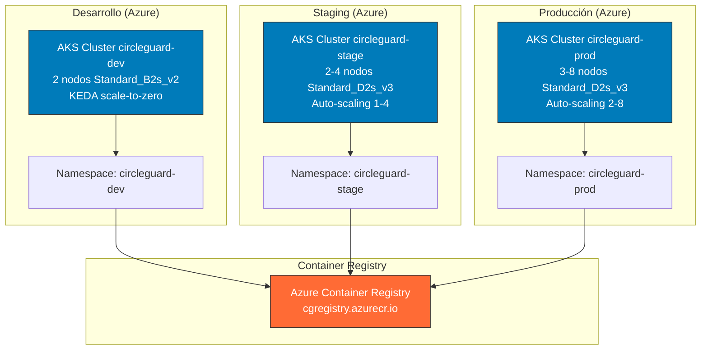
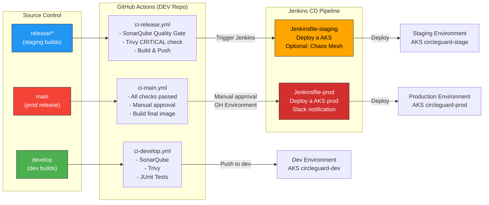

# Arquitectura de CircleGuard — Visión General

CircleGuard es una plataforma de microservicios distribuida en múltiples nubes diseñada para máxima resiliencia, escalabilidad y observabilidad. La arquitectura soporta tres ambientes independientes (desarrollo, staging, producción) en diferentes proveedores de infraestructura.

---

## Componentes Principales

### 1. Microservicios (circle-guard-development)

- **auth-service:** Autenticación dual (LDAP + Base de datos local)
- **identity-service:** Gestión de identidades y perfiles
- **promotion-service:** Lógica de promoción y salud de usuarios
- **gateway-service:** API Gateway (entrada única)
- **notification-service:** Notificaciones y alertas
- **form-service:** Recolección de formularios y encuestas

### 2. Middleware

- **PostgreSQL:** Base de datos relacional (usuarios, encuestas)
- **Neo4j:** Base de datos de grafos (relaciones sociales)
- **Kafka:** Message broker (eventos asíncronos)
- **Redis:** Cache distribuido
- **OpenLDAP:** Directorio corporativo

### 3. Infraestructura Azure (AKS)

- **AKS circleguard-dev:** Desarrollo (Standard_B2s_v2, KEDA)
- **AKS circleguard-stage:** Staging (Standard_D2s_v3, HPA)
- **AKS circleguard-prod:** Producción (Standard_D2s_v3, HPA + Istio)

---

## Diagrama 1: Arquitectura Azure (AKS)



---

## Diagrama 2: CI/CD Pipeline — Ramas y Flujo



---

## Diagrama 3: Red Kubernetes — Namespaces, Servicios e Istio

```mermaid
graph TB
    subgraph "Istio Service Mesh"
        istio_gateway["Istio Ingress Gateway"]
    end

    subgraph "Namespace: circleguard-prod"

        subgraph "API Layer"
            gateway["gateway-service<br/>Port 8080"]
        end

        subgraph "Core Services"
            auth["auth-service<br/>Authentication"]
            identity["identity-service<br/>Identity Management"]
            promotion["promotion-service<br/>Health Status"]
        end

        subgraph "Business Services"
            form["form-service<br/>Survey Collection"]
            notification["notification-service<br/>Alerts & Notifications"]
        end

        subgraph "Middleware"
            postgres["PostgreSQL<br/>StatefulSet"]
            neo4j["Neo4j<br/>Graph Database"]
            kafka["Kafka Broker<br/>Message Queue"]
            redis["Redis Cache<br/>Session Store"]
            ldap["OpenLDAP<br/>Directory"]
        end

        subgraph "Service Mesh"
            dr_auth["DestinationRule<br/>Circuit Breaker"]
            dr_identity["DestinationRule<br/>Retry Policy"]
            vs_auth["VirtualService<br/>Canary 80/20"]
        end

        subgraph "Monitoring"
            prometheus["Prometheus<br/>Metrics"]
            grafana["Grafana<br/>Dashboards"]
            jaeger["Jaeger<br/>Tracing"]
            kibana["Kibana<br/>Logs"]
        end

        istio_gateway --> gateway
        gateway --> auth
        gateway --> identity
        gateway --> promotion
        gateway --> form

        auth --> postgres
        auth --> redis
        auth --> ldap

        identity --> neo4j
        identity --> postgres
        identity --> redis

        promotion --> neo4j
        promotion --> kafka
        promotion --> redis

        form --> postgres
        form --> kafka

        notification --> kafka
        notification --> redis

        auth -.->|mTLS| dr_auth
        identity -.->|mTLS| dr_identity
        auth -.->|Canary| vs_auth

        prometheus -.->|scrape| auth
        prometheus -.->|scrape| identity
        prometheus -.->|scrape| promotion

        jaeger -.->|spans| auth
        jaeger -.->|spans| identity

        kibana -.->|logs| kafka
    end

    style istio_gateway fill:#666,stroke:#333,color:#fff
    style gateway fill:#2196f3,stroke:#333,color:#fff
    style auth fill:#4caf50,stroke:#333,color:#fff
    style identity fill:#4caf50,stroke:#333,color:#fff
    style promotion fill:#4caf50,stroke:#333,color:#fff
    style form fill:#4caf50,stroke:#333,color:#fff
    style notification fill:#4caf50,stroke:#333,color:#fff
    style postgres fill:#336791,stroke:#333,color:#fff
    style neo4j fill:#008cc1,stroke:#333,color:#fff
    style kafka fill:#231f20,stroke:#333,color:#fff
    style redis fill:#dc382d,stroke:#333,color:#fff
    style ldap fill:#52b3d9,stroke:#333,color:#fff
    style prometheus fill:#e6522c,stroke:#333,color:#fff
    style grafana fill:#f7b917,stroke:#333,color:#000
    style jaeger fill:#13adc7,stroke:#333,color:#fff
    style kibana fill:#005571,stroke:#333,color:#fff
```



---

## Flujos de Datos Clave

### 1. Saga Choreography — Health Survey Submission

```
form-service.submitSurvey()
  ├─ Guarda en PostgreSQL
  ├─ Publica: survey.submitted
  └─ Retorna al usuario

promotion-service (escucha survey.submitted)
  ├─ Actualiza estado en Neo4j
  ├─ Actualiza cache en Redis
  ├─ Publica: promotion.status.changed
  └─ HPA escala si necesario

notification-service (escucha promotion.status.changed)
  ├─ Envía notificaciones a usuarios
  ├─ Notifica contactos cercanos
  └─ Registra auditoría
```

### 2. Autenticación Dual

```
Usuario login request
  ├─ JWT Token validation (JwtAuthenticationFilter)
  ├─ DualChainAuthenticationProvider:
  │  ├─ Intenta LDAP (usuarios corporativos)
  │  └─ Si falla → Local DB (usuarios internos)
  ├─ SecurityContext populated
  └─ Request autorizado
```

### 3. Resilencia mediante Istio

```
Client request a identity-service
  ├─ Istio Envoy sidecar intercepta
  ├─ Circuit Breaker: 5 errores 5xx → aísla instancias
  ├─ Retry Policy: 3 intentos con backoff
  ├─ Timeout: 8 segundos
  └─ Fallback a réplica sana o error
```

---

## Patrones de Diseño Implementados

| Patrón | Ubicación | Propósito |
|--------|-----------|----------|
| **Repository Pattern** | Todos los servicios | Abstracción de acceso a datos |
| **Factory Pattern** | auth-service | Selección dinámica de proveedor de auth |
| **Observer Pattern** | Kafka Topics | Eventos asíncronos desacoplados |
| **Decorator Pattern** | JwtAuthenticationFilter | Validación transparente de JWT |
| **Circuit Breaker** | Istio DestinationRules | Prevención de cascadas de fallo |
| **External Configuration** | Kubernetes ConfigMaps | Configuración por ambiente |
| **Saga Choreography** | form → promotion → notification | Transacciones distribuidas |

---

## Seguridad

### Autenticación & Autorización
- **JWT Tokens** para requests API
- **LDAP Integration** para usuarios corporativos
- **Role-Based Access Control (RBAC)** en Kubernetes

### Cifrado
- **TLS/mTLS** mediante Istio (strict en prod, permissive en stage)
- **Sealed Secrets** para secrets sensibles en Kubernetes
- **Certificate Manager** + Let's Encrypt para certificados públicos

### Network Security
- **NetworkPolicies** por namespace
- **Service Mesh mTLS** para comunicación inter-servicios
- **Pod Security Policies** en production

---

## Observabilidad

### Logging
- **Filebeat** → **Logstash** → **Kibana**
- Logs centralizados por namespace
- Búsqueda y filtrado en tiempo real

### Metrics
- **Prometheus** scrape cada 15 segundos
- **Grafana** dashboards por servicio y namespace
- Alertas en AlertManager (mail, Slack)

### Tracing
- **Jaeger** para distributed tracing
- Rastreo de requests end-to-end
- Identificación de cuellos de botella

---

## Escalabilidad

### Horizontal Pod Autoscaler (HPA)
- **Dev (AKS):** KEDA scale-to-zero (0-3 réplicas)
- **Stage (AKS):** HPA 2-4 réplicas
- **Prod (AKS):** HPA 2-8 réplicas

### Cluster Autoscaling
- **Dev:** 1-3 nodos (Standard_B2s_v2)
- **Stage:** 1-4 nodos (Standard_D2s_v3)
- **Prod:** 2-8 nodos (Standard_D2s_v3)

### Pod Affinity
- **Prod:** podAntiAffinity requerido (spread across nodes)
- **Stage:** Preferred podAntiAffinity
- **Dev:** No restrictions

---

## Disaster Recovery

### Backup Strategy
- PostgreSQL: Snapshots diarios a Azure Blob Storage
- Neo4j: Backups exportados a ACR
- Configuración: Versionada en Git

### Rollback Procedures
- **Kubernetes:** `kubectl rollout undo deployment/<service>`
- **Data:** Restauración desde backups (manual)
- **RTO (Recovery Time Objective):** < 15 minutos en prod

### High Availability
- Multi-zona en todos los clusters
- Database replication
- Load balancers con health checks

---

## Costo Optimización

### Estrategias Implementadas
1. **KEDA Scale-to-Zero (Dev):** 40% ahorro en nodos AKS dev
2. **Cluster Autoscaling:** 20% ahorro en compute en staging y prod
3. **Azure Reserved Instances:** Descuento adicional en prod con VM reservadas
4. **Right-Sizing:** Ajuste dinámico de recursos via Kubecost

### Monitoreo de Costos
- **Kubecost** dashboards por namespace y workload
- Alertas por gasto anómalo
- Reportes mensuales de FinOps

Ver [cost-analysis.md](./cost-analysis.md) para detalles completos.

---

## Chaos Engineering

CircleGuard implementa **Chaos Mesh** para validar resiliencia:

- **PodChaos:** Kill pods cada 2 minutos → valida auto-healing
- **NetworkChaos:** Inyecta 500ms latencia → valida retry policies
- **StressChaos:** CPU 90% en Neo4j → valida HPA scaling

Ver [chaos-results.md](./chaos-results.md) para resultados detallados.

---

## Referencias

- Patrones: Ver [design-patterns.md](./design-patterns.md)
- Costos: Ver [cost-analysis.md](./cost-analysis.md)
- Operaciones: Ver [operations-manual.md](./operations-manual.md)
- Cambios: Ver [change-management.md](./change-management.md)
- Kubernetes Manifests: `k8s/` directory
- Terraform IaC: `infra/` directory
- CI/CD Pipelines: Jenkinsfiles en raíz
